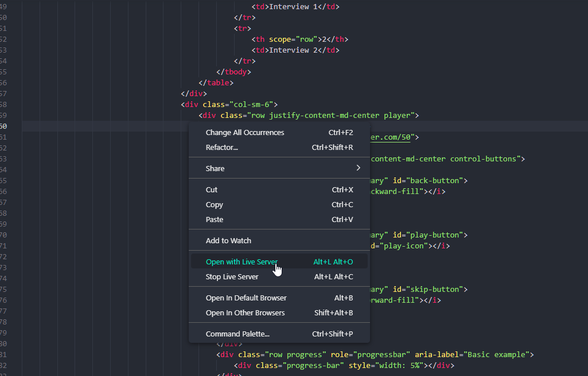
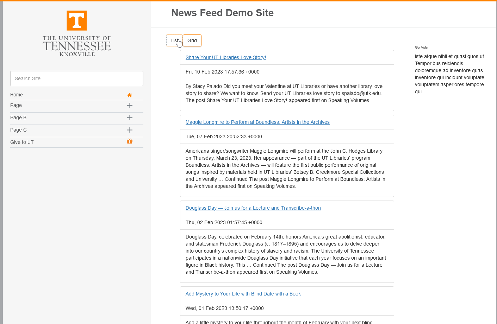
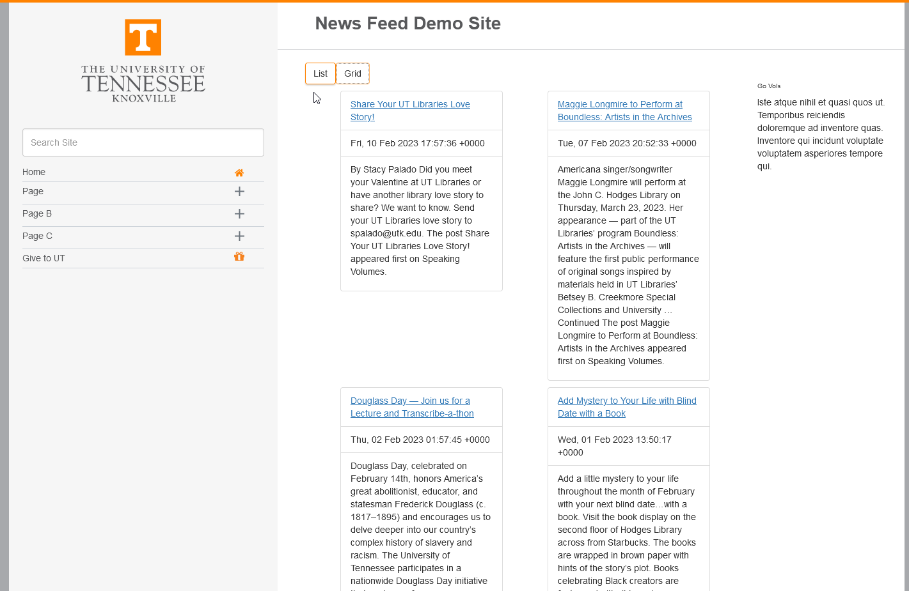

# Demo News Feed Adjustable Format

  ## About/Description

  This repo is meant as a demo project for the news feed with adjustable layout for an interview. The buttons at the top of grid and list modes change the look how the information is displayed.  I also used Express and an RSS Parser to download the RSS feed information to store it locally in a JSON file to allow for the data to be dynamically loaded onto the page.

  ## Table of Contents

  * [Installation](#installation)
  * [Usage](#usage)
  * [Languages](#languages)
  * [Contributing](#contributing)
  * [License](#license)
  * [Tests](#tests)
  * [Questions](#questions)
  
  ## Installation

  This application uses the VS Code extension live server.  This extension is turned on by right clicking on the index.html and selecting live server.  Without it, the template code used from the University of Tennesee will not work. 

  ## Usage

  ### Screenshots

  #### Opening project with Live Server Extension

  

  #### List Example Screenshot

  

  #### Grid Example Screenshot

  

  ## Languages

  JavaScript HTML CSS JQuery Express RSS Parser Bootstrap

  ## Contributing

  Contributions by: David Shaw

  If you would like to contribute to this project we follow the [Contributor Covenant](https://www.contributor-covenant.org/)

  ## Questions:

  If you have any questions please contact us or refer to our github below:

  Email Us At: david.shaw1242@gmail.com

  Github Repo: https://github.com/ds1242/u-t-newsfeed 